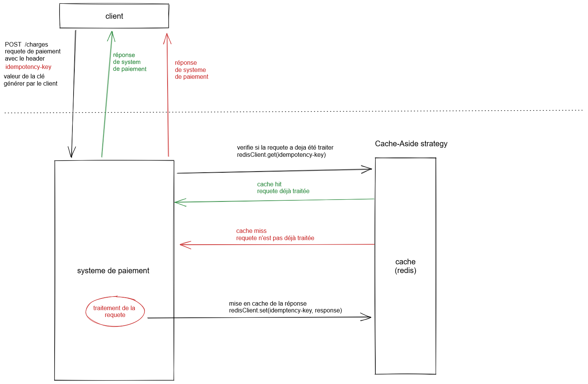

# CC2
Conception et implémentation d'un système de retry avec une solution de cache (côté backend)

## Conception
Utilisation de **Cache-Aside** comme stratégie du cache en utilisant **redis**.  

**structure de cache**
| key | value | 
----- |-------|
idempotency-key | résultat de traitement de paiement (requete POST)



## Utilisation
```
$ git clone git@github.com:izemaghilas/al-cc2.git
$ cd al-cc2
$ npm install
$ npm start
```
envoi d'une requete POST en ajoutant le header **idempotency-key**, on utilisant ***Postman*** ou équivalent.
